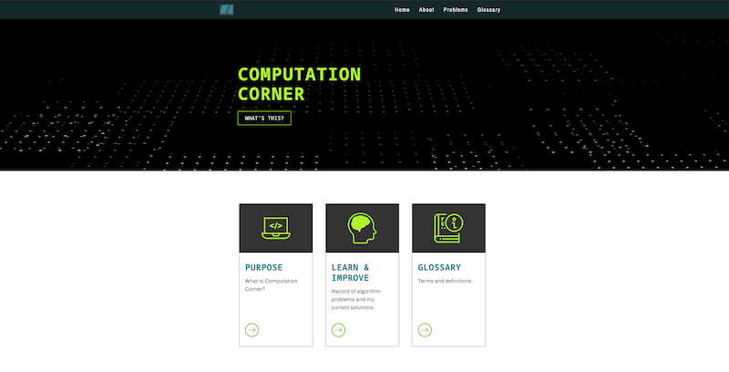
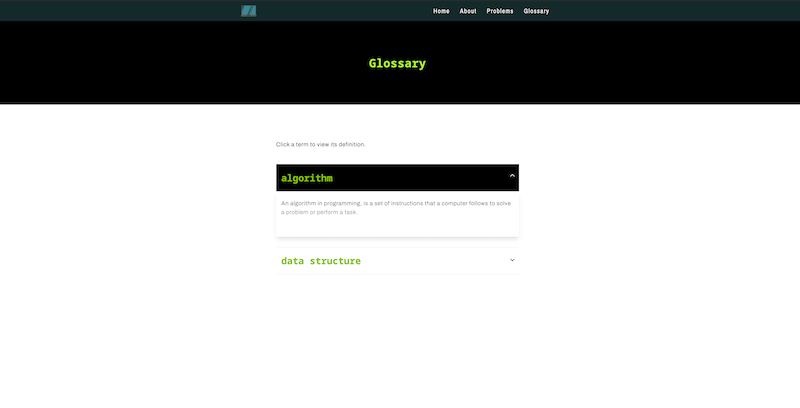

# Computation Corner (WIP)

<em>Computation Corner</em> is an ongoing, personal project that contains a collection of information relating to data structures and algorithms. Such information includes a glossary, as well as problems and solutions.

I'm building Computation Corner with the intentions of having it serve as both a direct DSA resource, and a space to record the logic involved in solving various problems.

## Technologies Used

|  **NextJS** |  **Tailwind** |
|:-:|:-:|

## Visit the Site

Check out the website [here](https://computation-corner.vercel.app/)!

## Screenshots

Once the page loads, you'll see the content shown below. You'll start with $500.00 (and hopefully leave with more!). Enter your bet and click the "Bet" button to begin.
 

 

